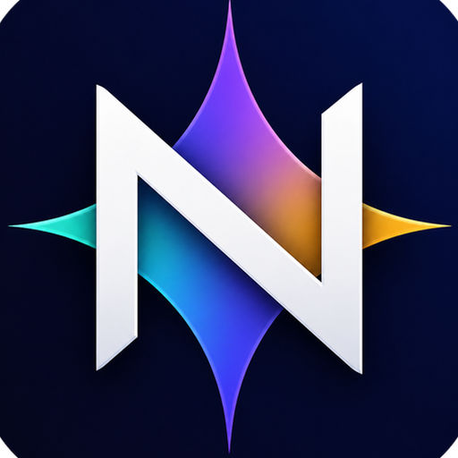

<p align="center">
  <a href="./README.md">English</a> | <a href="./README.zh-CN.md">簡體中文</a> | <a href="./README.zh-TW.md">繁體中文</a>
</p>

<div align="center">
  <a href="https://github.com/yeahhe365/Gemini-Nexus">
    
  </a>

# Gemini Nexus

### 賦予瀏覽器原生 AI 能力

  <p>
    
    
    
  </p>

  <p>
    
    
    
  </p>

  <p>
    <a href="README.md">English README</a> · <a href="README.zh-CN.md">簡體中文 README</a>
  </p>

---

</div>

### 專案簡介

**Gemini Nexus** 賦予瀏覽器原生 AI 能力，是一款集成 Gemini Web、Google Gemini API、OpenAI Compatible API 以及多個第三方專門 API 管道的 Chrome 擴充功能。它不僅僅是一個側邊欄插件，而是透過注入式的**浮動工具列**、圖片與截圖輸入、基於 Chrome DevTools Protocol 的**瀏覽器控制工具**以及可選的**外部 MCP 工具**，將 AI 的能力伸向網頁瀏覽的每一個互動細節。

### 能力概覽

Gemini Nexus 目前圍繞瀏覽器内 AI 工作流提供以下能力：

- **Gemini Web**、**Gemini API**、**OpenAI Compatible API**、**OpenAI 官方 API**、**DeepSeek API**、**OpenRouter API**、**通義 / DashScope API**、**Anthropic API** 與 **智譜 API** 多提供方切換，支援依管道設定 `Base URL`、`API Key` 與 `Model IDs`。
- **Gemini Web 臨時對話** 開關，可讓 Web 管道請求不進入 Gemini 近期對話。
- **Gemini API Google Search grounding** 支援，並在回覆中顯示連網來源。
- **OpenAI Compatible API 連網搜尋** 支援，可依目前介面使用 Responses API `web_search` 或 Chat Completions `web_search_options`。
- **側邊欄按分頁顯示范围控制**，支援減少在不需要的分頁中的干擾。
- **歷史使用者訊息編輯**，支援从歷史位置重新編輯并繼續对话；该能力仅在 API 管道啟用。
- **上下文管理**，支援摘要壓縮和最近 N 輪裁切，降低长工作階段超過模型上下文的風險。
- **瀏覽器控制受控分頁群組**，会用 Chrome 原生标签组标识目前任務，并让 `list_pages` / `select_page` 等工具聚焦在受控范围内。
- 外部連結统一在瀏覽器新分頁打开，避免在側邊欄中載入外部網站失敗。
- 擴充功能身分與本機升級流程会尽量保留設定，提升覆蓋安裝时的穩定性。

### 多驅動核心比較

專案内置了多种驅動方案，位于 `services/providers`，并透過代码逻辑动态适配不同的使用场景：

| 驅動方案              | 邏輯入口               | 支援模型                 | 核心優勢                                                            | 使用前提                 |
| :-------------------- | :--------------------- | :----------------------- | :------------------------------------------------------------------ | :----------------------- |
| **Web Client**        | `web.js`               | 目前 Gemini Web 聊天模式 | **免 API Key**，重用 Gemini 網頁版工作階段，支援可選臨時對話        | 需要保持 Google 帳號登录 |
| **Official API**      | `official.js`          | Gemini Flash/Pro 預覽版  | **快速回應**，支援 **Thinking** 與 Google Search grounding          | 需 Google AI Studio Key  |
| **OpenAI Compatible** | `openai_compatible.js` | GPT/Claude/兼容模型      | **高擴充性**，支援 Chat Completions / Responses API 與可選連網搜尋  | 需第三方服务金鑰         |
| **OpenAI 官方 API**   | `openai_compatible.js` | GPT 推理/搜尋模型        | 專門走 Responses API，支援 reasoning summary 與可選連網搜尋         | 需 OpenAI API Key        |
| **DeepSeek API**      | `openai_compatible.js` | DeepSeek 对话/推理模型   | DeepSeek Chat Completions 預設端点，并顯示 `reasoning_content`      | 需 DeepSeek API Key      |
| **OpenRouter API**    | `openai_compatible.js` | OpenRouter 模型 ID       | 可拉取 `/models`，支援 provider routing JSON 與原生 `reasoning`     | 需 OpenRouter API Key    |
| **通義 / DashScope**  | `openai_compatible.js` | Qwen 文本與 VL 模型      | 專門 DashScope 兼容端点，傳送 `enable_thinking` 并支援 VL 圖片輸入  | 需 DashScope API Key     |
| **Anthropic API**     | `anthropic.js`         | Claude 模型              | 原生 Messages API，支援圖片輸入與 extended thinking 流式顯示        | 需 Anthropic API Key     |
| **智譜 API**          | `openai_compatible.js` | GLM 模型                 | 專門 GLM Chat Completions profile，并傳送原生 thinking 開關 payload | 需智譜 API Key           |

### 瀏覽器控制能力集

基於 `background/control/` 模块和 Chrome DevTools Protocol 实现，AI 可以透過本機工具循环执行复杂的 Agent 任务：

| 分类         | 核心指令                                                               | 程式碼實作邏輯                                                                          |
| :----------- | :--------------------------------------------------------------------- | :-------------------------------------------------------------------------------------- |
| **導覽控制** | `navigate_page`, `new_page`, `close_page`, `list_pages`, `select_page` | 呼叫 `chrome.tabs` 進行頁面生命週期管理                                                 |
| **頁面互動** | `click`, `hover`, `fill`, `fill_form`, `press_key`, `type_text`        | 基於 **Accessibility Tree** 產生 UID 進行精準操控，支援懸停、批次填表、組合鍵與聚焦輸入 |
| **資料觀測** | `take_snapshot`, `wait_for`, `handle_dialog`                           | 擷取頁面無障礙樹并生成可重用 UID，也可等待目標文字出現或处理阻塞彈窗                    |
| **腳本執行** | `evaluate_script`                                                      | 在網頁 Context 中執行自訂 JavaScript                                                    |

瀏覽器控制啟用後会鎖定一個目標分頁，并用 Chrome 原生标签组顯示目前任務标题。`select_page` 預設只在受控分頁群組内切换；`new_page` 的一般分頁会加入該群組，`background: true` 則會打开獨立 popup 視窗以減少焦點干擾。

### 外部 MCP 工具

Gemini Nexus 可以選擇连接到一個或多個外部 MCP 服务器（透過 **SSE**、**可流式传输的 HTTP** 或 **WebSocket**），並在现有的工具循环（Tool Loop）中执行其工具。

#### 推荐方案：使用本機代理（支援 stdio 服务器）

由于 Chrome 擴充功能无法直接執行基於 stdio 的 MCP 服务器，推荐的設定方案是執行一個本機代理（例如 [MCP SuperAssistant](https://github.com/srbhptl39/MCP-SuperAssistant) Proxy）。在代理中設定您的 MCP 服务器（包括 stdio 服务器），然后將 Gemini Nexus 连接到该代理端点。

常见的代理端点如下：

- **SSE**: `http://127.0.0.1:3006/sse`
- **可流式传输的 HTTP**: `http://127.0.0.1:3006/mcp`
- **WebSocket**: `ws://127.0.0.1:3006/mcp`

#### 設定步骤

1. 启动您的 MCP 代理並在其中設定好 MCP 服务器。
2. 在 **設定 (Settings) -> 连接 (Connection) -> 外部 MCP 工具 (External MCP Tools)** 中：
    - 啟用“外部 MCP 工具” (Enable External MCP Tools)。
    - 新增或選擇服务器条目；**活动服务器** (Active Server) 表示目前正在编辑的条目，对话时会使用所有已啟用的服务器。
    - 選擇传输协议并設定服务器 URL（SSE / 可流式传输的 HTTP / WebSocket）。
    - 如需自訂請求头，请使用 SSE 或可流式传输的 HTTP；瀏覽器擴充环境下 WebSocket 传输不支援自訂 headers。
    - 点击**測試连接** (Test Connection) 和**刷新工具** (Refresh Tools)。
3. 可選（当工具较多时推荐）：將**公开工具** (Expose Tools) 設定为**仅限选定工具** (Selected tools only)，然后仅啟用您希望模型查看/使用的工具。
4. 开始正常对话；当模型需要使用工具时，它会输出一個如下所示的 JSON 工具块。多服务器模式下，模型可能会使用 `serverId__toolName` 形式的唯一工具名来路由到具体服务器：

    ```json
    { "tool": "工具名称", "args": { "键": "值" } }
    ```

### 核心功能亮点

- **智能側邊欄**：基於 `sidePanel` API，提供毫秒级唤起的对话空间，支援全文搜尋歷史记录。
- **划词工具栏**：注入 Content Script，选繁體中文字即刻進行**翻譯、摘要、解释、语法修正**，支援一键回填表单。
- **圖片與截圖輸入**：
    - **OCR & 截圖翻譯**：集成 Canvas 裁剪技术，框选圖片区域即刻擷取文字并翻譯。
    - **屏幕/視窗截圖**：側邊欄可透過瀏覽器的 `display-capture` 能力選擇其他屏幕或应用視窗作为圖片輸入。
    - **浮窗探测**：自动识别網頁圖片并生成悬浮 AI 分析按钮。
    - **生成圖片顯示**：顯示拉取到的 Gemini 原图，不在本機重写圖片像素。
    - Gemini Web 逆向驱动目前支援圖片附件；PDF、文本、文档类附件请使用 Gemini API 管道。
- **安全渲染**：所有 Markdown、LaTeX 公式及代码块均在 `sandbox` 隔离环境中渲染，确保主頁面安全。

### Gemini Web 维护说明

Gemini Web 依赖逆向协议，可能随网站更新而变化。目前契约记录在 [`docs/gemini-web-reverse.md`](docs/gemini-web-reverse.md)，包含已验证 token、RPC 路径、上传流程、模型 hash、臨時對話标记、暂不支援的 image-preview 模型路由，以及手动漂移检查命令。

### 快速开始

#### 仓库结构

本仓库根目錄就是可執行的 Chrome 擴充專案根目錄。`package.json`、`manifest.json`、Vite 設定、源码、測試和打包脚本都位于根目錄。跨執行域共享的工具代码位于 `shared/`，并按能力群組到 `shared/attachments/`、`shared/config/`、`shared/dom/`、`shared/logging/`、`shared/mcp/`、`shared/media/`、`shared/messaging/`、`shared/models/`、`shared/settings/`、`shared/text/`、`shared/ui/` 和 `shared/utils/`；不再保留顶层 `shared/*.js` 兼容入口。模块目錄的聚合入口统一使用目錄内 `index.js`，避免出現同级 `foo.js` 與 `foo/` 并存；執行域入口保留为各執行域根部的 `index.js`，例如 `background/index.js`、`content/index.js`、`sandbox/index.js`、`sidepanel/index.js`，以及独立設定页 `settings/index.js`。執行时代码檔案使用 `snake_case`，仓库工具脚本和工作流檔案可使用 `kebab-case`。

#### 安裝步骤

1. 从 [Releases](https://github.com/yeahhe365/Gemini-Nexus/releases) 下载最新 ZIP 包并解压。
2. Chrome 访问 `chrome://extensions/`，右上角开启 **“開發者模式”**。
3. 点击 **“載入已解压的擴充功能”**，選擇解压后的檔案夹即可。

#### 从源码建置與打包

```bash
npm install
npm run package:extension
```

打包完成后，Chrome 的 **“載入已解压的擴充功能”** 应選擇 `artifacts/chrome-extension`。開發调试时也可以直接載入仓库根目錄，但发布或手动安裝推荐使用打包目錄；`npm run build` 生成的 `dist/` 只是 Vite UI 建置产物，不是完整擴充目錄。发布包会把多個 content scripts 按 `manifest.json` 中的顺序合并为单个 `content/index.js`，并重写包内 manifest，避免发布产物依赖一长串手工脚本顺序。

#### 发布到 Chrome Web Store

Chrome Web Store 发布凭据只儲存在本机，不要提交到仓库：

```bash
cp .env.chrome-webstore.example .env.chrome-webstore
```

编辑 `.env.chrome-webstore`，填入 `CHROME_WEBSTORE_PUBLISHER_ID`、`CHROME_WEBSTORE_ITEM_ID` 和具备 `https://www.googleapis.com/auth/chromewebstore` scope 的 `CHROME_WEBSTORE_ACCESS_TOKEN`。准备好 ZIP 后執行：

```bash
npm run publish:chrome-webstore
```

脚本会呼叫 Chrome Web Store API v2 上传 `CHROME_WEBSTORE_ZIP_PATH` 指向的 ZIP，并提交发布审核。

### 技术栈

- **建置工具**：Vite + TypeScript
- **架构协议**：Chrome MV3 + Chrome DevTools Protocol + 本機/外部 MCP 工具呼叫
- **核心库**：Marked.js, KaTeX, Highlight.js, Fuse.js

### 授權條款

本專案基於 **MIT License** 开源。

### 致谢

本專案已在 [LINUX DO 社区](https://linux.do) 发布，感谢社区的支援與反馈。
